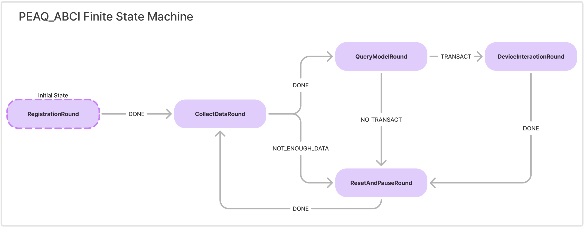

# Energy Management Agent with OLAS




## System requirements

- Python `>=3.8`
- [Tendermint](https://docs.tendermint.com/v0.34/introduction/install.html) `==0.34.19`
- [IPFS node](https://docs.ipfs.io/install/command-line/#official-distributions) `==0.6.0`
- [Pip](https://pip.pypa.io/en/stable/installation/)
- [Poetry](https://python-poetry.org/)
- [Docker Engine](https://docs.docker.com/engine/install/)
- [Docker Compose](https://docs.docker.com/compose/install/)

Alternatively, you can fetch this docker image with the relevant requirements satisfied:

> **_NOTE:_**  Tendermint and IPFS dependencies are missing from the image at the moment.

```bash
docker pull valory/open-autonomy-user:latest
docker container run -it valory/open-autonomy-user:latest
```

## This repository contains:
 ```bash
 TODO
 ```

## How to use

Create a virtual environment with all development dependencies:

```bash
poetry shell
poetry install
```